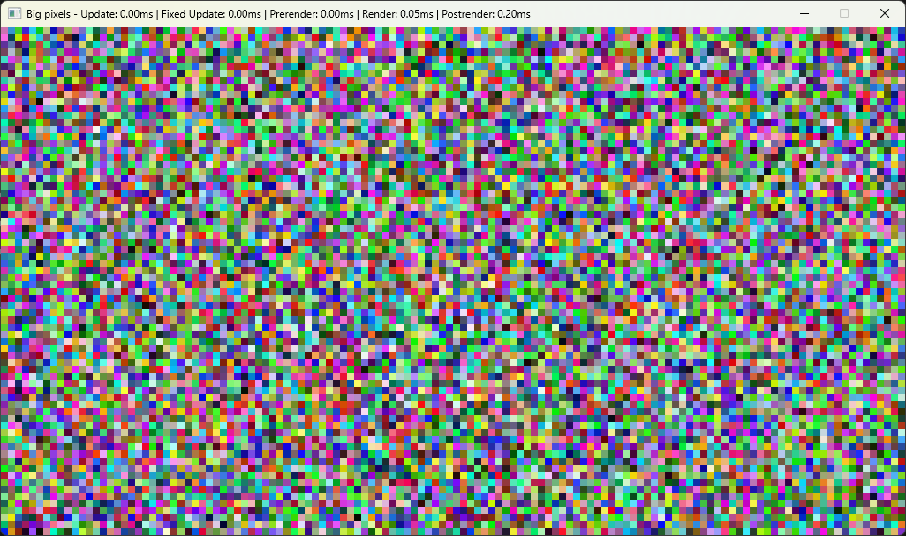

# PixelWindow
A simple framework for drawing realtime direct per-pixel graphics in C# for applications such as raycasters, raytracers, retro games, and fractal rendering. This uses the .Net binding of [SFML](https://www.sfml-dev.org/) for rendering, which allows for easy use of its additional functionality such as image loading, audio, and input.

This framework allows you to render at magnified pixel sizes, for example, the following example program will create a window of size 1024x576, with pixels 8x screen pixel size, resulting in a 128x72 drawing area.
```c#
new PixelWindow(1024, 576, 8, "Big pixels", ...
```

When you create the window, you specify a number of functions -
* An onload function which gives you the SFML window so you can use it for input etc.
* An update function which runs every frame
* An update function which runs once per fixed timestep increment
* A render function which runs every frame and gives you access to set direct pixel data

A basic setup can be seen in [Program.cs](src/PixelWindow/Program.cs), which renders randomly coloured pixels at as high a framerate as it can up to the specified framerate limit. As seen in the window title (showing a total render time of 0.5ms), this is able to render at a couple of thousand frames per second, so the performance of the framework shouldn't hold back the performance of your rendering code on modern hardware.



# FAQ
### Why does the post render take so long?
This value includes whatever framerate limit you have set. If you limit the framerate to 10fps for example, you should expect to see the post render take around 100ms or more.
